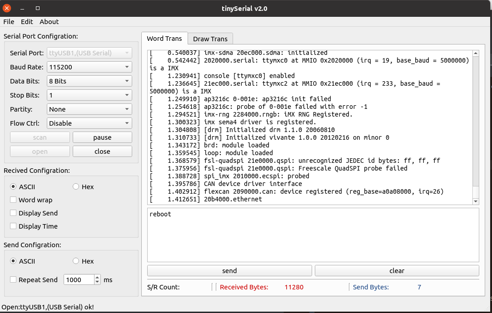
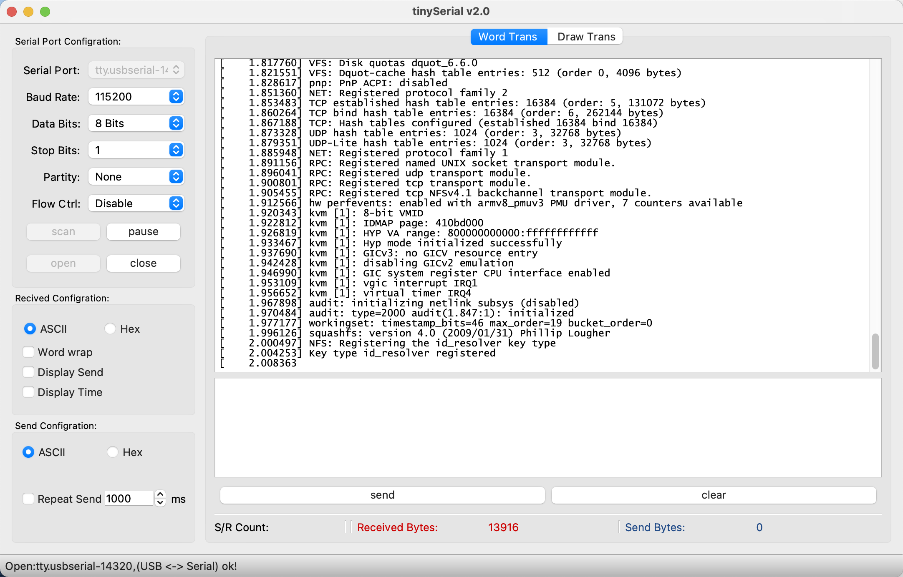

# A GUI Serial Debug Tool for Linux/Mac OS

Welcome to use the Tiny Serial that is a GUI serial debug tool for Linux/Unix(Ubuntu Mac etc) . Tiny Serial is a open source project based on Qt C++ framework. There are the general functions as COMMON serial port debug tool.  More new features will be developed. If you have any question and bugs found, please don't hesitate to push a new ISSUE on GitHub for us, we will deal with it at our convenient time. Thanks for your using.
### Ubuntu Interface

### Mac OS Interface

## Starting with TinySerial

You can get the new latest version on the release page (https://github.com/carloscn/tinyserial/releases)

For Ubuntu user, you can use the `sudo dpkg -i xxxx.deb` to finish the installation of the TinySerial. If you run into the dependency problem during the installing, please use the `sudo apt-get install -f ` to resolve it.

**The other platform user need download the source code and compile the code by yourself.** 

## Using the TinySerial

Input `tinyserial` on your command line and input your password.

Enjoy it. :) 

## TODO List

1. Dynamic USB devices checking
2. Custom of serial baud rate.
3. MAC version adapting.

## Note
The tinyNetwork tool is linked to https://github.com/carloscn/tinyNetwork
