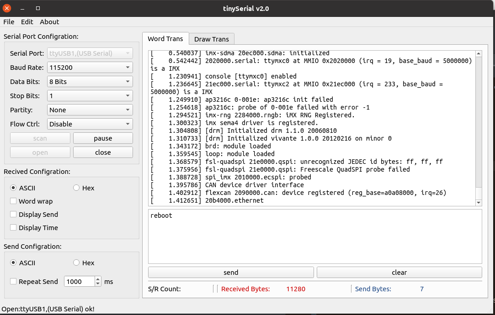

# A GUI Serial Debug Tool for Linux

Welcome to use the Tiny Serial that is a GUI serial debug tool for linux(ubuntu/manjara etc). Tiny Serial is a open source project based on Qt C++ framework. There are the basic functions as COMMON serial port debug tool.  More new features will be developed. If you have any question and bug found, please not hesitate to pull a new ISSUE on GitHub for us, i will deal with it at my convenient time. Thanks for your using.

## Starting with TinySerial

You can get the new latest version on https://github.com/carloscn/tinyserial/releases

For ubuntu user, you can use the `sudo dpkg -i xxxx.deb` to finish the setup of the TinySerial. If there is a dependency problem, please use the `sudo apt-get install -f ` to resolve it.

**The other platform user need download the source code and compile the code by yourself.** 

## Using the TinySerial

Input `tinyserial` on your command line and input your password.

Enjoy it. :) 