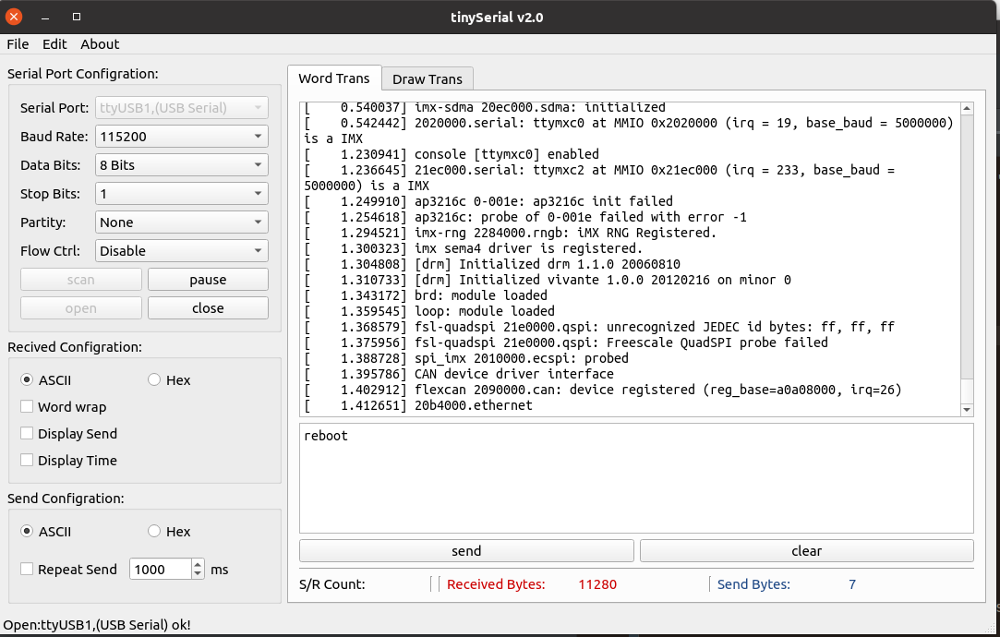
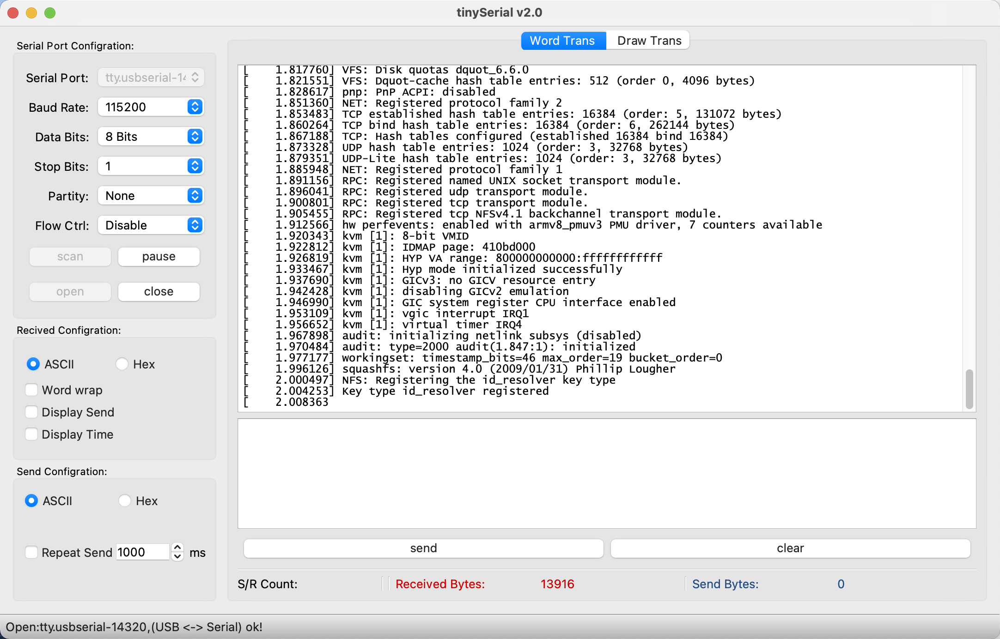

# TinySerial

<div align="center">



**A cross-platform GUI serial port debug tool built with Qt5**

[](LICENSE)
[](https://github.com/carloscn/tinyserial)
[](https://www.qt.io/)

</div>

## 📖 Overview

TinySerial is an open-source, cross-platform serial port debugging tool designed for developers and engineers who need to communicate with embedded devices, microcontrollers, and other serial devices. Built with Qt5 framework, it provides a user-friendly graphical interface for serial communication testing and debugging.

### ✨ Key Features

- 🔌 **Serial Port Management**: Automatic port scanning and easy connection
- 📊 **Dual Format Support**: ASCII and HEX data transmission modes
- 🔄 **Auto Repeat**: Configurable automatic data sending
- 📝 **Data Logging**: Save communication logs to files
- ⏱️ **Timestamp Display**: Optional timestamp for each message
- 🎨 **Modern UI**: Clean and intuitive user interface
- 🌐 **Cross-Platform**: Supports Linux and Windows
- 🔧 **Flexible Configuration**: Customizable baud rates, parity, stop bits, and flow control

## 🖼️ Screenshots

### Ubuntu/Linux Interface


### macOS Interface



## 🚀 Quick Start

### Install from apt.mltz.tech

Each Ubuntu release has its own package, built against that release's libraries. The host is the same. Only the suite name changes.

| Ubuntu | Suite |
| --- | --- |
| 20.04 | `focal` |
| 22.04 | `jammy` |
| 24.04 | `noble` |
| 26.04 | `resolute` |

Ubuntu 26.04:

```bash
sudo curl -fsSL https://apt.mltz.tech/key.gpg -o /usr/share/keyrings/mltz.gpg
echo "deb [signed-by=/usr/share/keyrings/mltz.gpg] https://apt.mltz.tech resolute main" | sudo tee /etc/apt/sources.list.d/mltz.list
sudo apt-get update
sudo apt-get install tinyserial
```

On 22.04, replace `resolute` with `jammy`. On 24.04 use `noble`. On 20.04 use `focal`.

After installation, open **TinySerial** from the application menu, or run `tinyserial`. The menu entry does not open a terminal. The program is also at `/opt/tinyserial/tinyserial`.

Serial ports need the `dialout` group. Log out and back in after:

```bash
sudo usermod -a -G dialout "$USER"
```

### Other platforms

Windows and macOS builds are not published to the apt repository. Clone the repository and build with qmake, as described below.

## 📋 System Requirements

- **Published packages:** Ubuntu 20.04, 22.04, 24.04, and 26.04 (amd64)
- **Qt:** 5.12 or newer. The packages use the Qt libraries shipped by that Ubuntu release
- **Also required:** permission to open serial devices (`dialout` on Ubuntu)

`gen_deb.sh` fills the package `Depends` line from the binary on the machine where the package is built. Qt already depends on X11, zlib, and GLib, so those are not listed again.

## 🔨 Building and publishing

### One package on the current Ubuntu

```bash
sudo apt-get install qt5-qmake qtbase5-dev libqt5serialport5-dev dpkg-dev
./script/build-deb.sh
```

The package is written to `dist/tinyserial_<version>_ubuntu<release>_amd64.deb`.

### All four Ubuntu releases

`script/build-docker.sh` compiles 20.04, 22.04, 24.04, and 26.04. The Qt and compiler packages for each release stay in the BuildKit cache at `/hrom/tinyserial/buildkit` on tensor1 (or `.docker-store/buildkit/` elsewhere). The next compile reuses that cache. Those packages are installed again only when the install step in `docker/Dockerfile` changes.

```bash
git clone https://github.com/carloscn/tinyserial.git /hrom/tinyserial/src
cd /hrom/tinyserial/src
./script/build-docker.sh
```

### Publish a release

From a machine logged in with `gh`, after the packages are in `dist/`:

```bash
./script/release.sh
```

That uploads the `.deb` files to a GitHub Release. The release workflow copies each file to `apt.mltz.tech`. The filename selects the suite: `ubuntu20.04` goes to `focal`, `ubuntu22.04` to `jammy`, `ubuntu24.04` to `noble`, and `ubuntu26.04` to `resolute`.

Raise `Version` in `tinyserial-deb-prj/DEBIAN/control` before publishing a new release. Each Ubuntu build is published as `<version>+ubuntuX.Y`, so the four binaries can sit in one apt pool.

### Build by hand

```bash
qmake SerialPort.pro
make
./tinyserial
```

On Windows with MinGW, use `qmake SerialPort.pro` and `mingw32-make`. `sudo make install` on Linux also installs a launcher under `/usr/local`.

## 📖 Usage Guide

### Basic Operations

1. **Scan for Serial Ports**: Click the "Scan" button to detect available serial ports
2. **Configure Port Settings**: Select baud rate, data bits, stop bits, parity, and flow control
3. **Connect**: Click "Open" to establish connection
4. **Send Data**: 
   - Enter data in the send text area
   - Choose ASCII or HEX format
   - Click "Send" or enable auto-repeat
5. **View Received Data**: Received data appears in the receive area
6. **Save Logs**: Use "Save Log File" from the menu to export communication logs

### Advanced Features

- **Auto Repeat**: Enable repeat sending with configurable interval
- **Display Options**: Toggle timestamp and send/receive indicators
- **Pause Output**: Temporarily pause receiving data display
- **Custom Baud Rate**: Enter custom baud rate values

## 🛠️ Troubleshooting

### Common Issues

**Q: TinySerial does not appear in the application menu**
- Upgrade to 1.5.2 or newer. Older packages removed the menu entry while upgrading.
  ```bash
  sudo apt-get update
  sudo apt-get install --reinstall tinyserial
  ```
- Then search for TinySerial in the application grid. A running session picks the new entry up within a few seconds.

**Q: Application won't start**
- Install it with apt so the Qt libraries for that Ubuntu release are installed
- Check the program: `ls -l /opt/tinyserial/tinyserial`

**Q: Can't find serial ports**
- Verify your user has permission to access serial ports
- On Linux, you may need to add your user to the `dialout` group:
  ```bash
  sudo usermod -a -G dialout $USER
  ```
- Log out and log back in for changes to take effect

**Q: Permission denied errors**
- Run with appropriate permissions or configure udev rules for persistent access

**Q: Dependency issues on Linux**
- See the [package troubleshooting guide](tinyserial-deb-prj/README.md)

## 🤝 Contributing

Contributions are welcome! If you find bugs or have feature requests, please:

1. Open an [issue](https://github.com/carloscn/tinyserial/issues) on GitHub
2. Fork the repository and create a feature branch
3. Submit a pull request with your changes

## 📝 TODO

- [ ] Dynamic USB device detection
- [ ] Enhanced custom baud rate support
- [ ] macOS version optimization
- [ ] Data visualization and plotting
- [ ] Script automation support

## 🔗 Related Projects

- [tinyNetwork](https://github.com/carloscn/tinyNetwork) - Network debugging tool by the same author

## 📄 License

This project is licensed under the Mozilla Public License 2.0 (MPL-2.0). See the [LICENSE](LICENSE) file for details.

## 👤 Author

**Carlos Wei**

- Email: carlos.wei.hk@gmail.com
- GitHub: [@carloscn](https://github.com/carloscn)
- Homepage: http://www.mlts.tech/

## 🙏 Acknowledgments

- Built with [Qt Framework](https://www.qt.io/)
- Part of the MULTIBEANS project

## 📞 Support

If you encounter any issues or have questions:

- 📧 Email: carlos.wei.hk@gmail.com
- 🐛 [Report Issues](https://github.com/carloscn/tinyserial/issues)
- 📖 [Documentation](tinyserial-deb-prj/README.md)

---

<div align="center">

**Made with ❤️ by Carlos Wei**

⭐ Star this repo if you find it useful!

</div>
